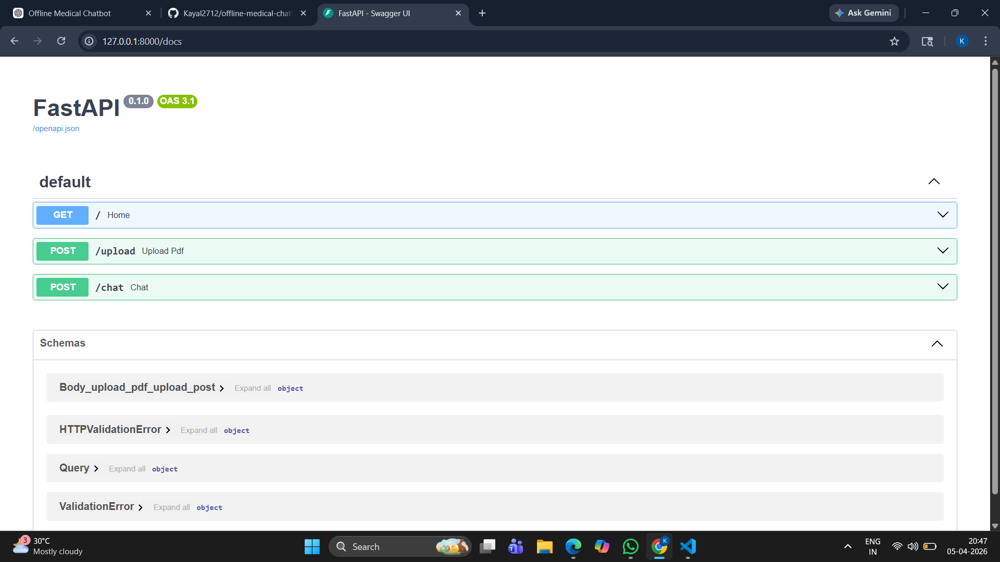

# 🩺 Offline Medical Chatbot

## 📌 Description
This project is a fully offline AI medical chatbot that analyzes medical reports and answers health-related questions.

## 🚀 Features
- Works completely offline
- Upload medical reports (PDF)
- Detects sugar, BP, cholesterol, hemoglobin
- AI-powered responses
- Symptom-based suggestions

## 🛠️ Tech Stack
- Ollama (Phi-3)
- FastAPI
- ChromaDB
- Python

## ⚙️ How it Works
1. Upload medical report
2. Extract text from PDF
3. Store in vector database
4. AI answers user queries

## ▶️ How to Run

pip install -r requirements.txt  
ollama run phi3  
uvicorn app:app --reload

## 🔒 Privacy
This system works completely offline. No data is sent to the cloud.

## 👨‍💻 Author
Kayalvizhi S
## 📷 Demo

## 🏗️ System Architecture

